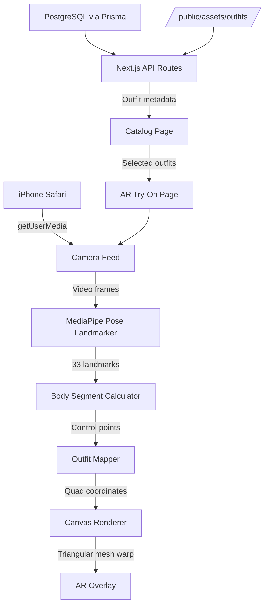

# MirrorMe – AR Virtual Try-On

> Try before you buy. In AR. Right now.

MirrorMe is a full-stack AR virtual try-on web application that lets users try on clothing in real-time through their iPhone camera via Safari. No app download required.

## Architecture



## Tech Stack

| Layer | Technology |
|-------|-----------|
| Frontend | Next.js 14 (App Router), TypeScript, Tailwind CSS |
| AR Engine | MediaPipe Pose Landmarker (WASM + GPU delegate) |
| Rendering | HTML5 Canvas 2D with triangular mesh warping |
| Backend | Next.js API Routes |
| Database | PostgreSQL via Prisma ORM |
| Assets | Self-hosted PNG outfit files |
| Deployment | Railway (Docker) |
| PWA | Service Worker with Workbox-style caching |

## Getting Started

### Prerequisites

- Node.js 20+
- PostgreSQL database
- ngrok or similar for iPhone testing (camera requires HTTPS or localhost)

### 1. Clone and install

```bash
git clone <repo-url>
cd AR-Core
npm install
```

### 2. Environment setup

```bash
cp .env.example .env.local
# Edit .env.local and set DATABASE_URL
```

### 3. Download MediaPipe models

The app self-hosts MediaPipe WASM and model files to avoid Safari CDN CORS issues.

```bash
# Download pose_landmarker_lite.task model
curl -o public/models/pose_landmarker_lite.task \
  https://storage.googleapis.com/mediapipe-models/pose_landmarker/pose_landmarker_lite/float16/latest/pose_landmarker_lite.task

# Download MediaPipe WASM files from npm package
mkdir -p public/models/mediapipe
cp node_modules/@mediapipe/tasks-vision/wasm/* public/models/mediapipe/
```

### 4. Set up database and seed outfits

```bash
# Generate Prisma client
npm run db:generate

# Run migrations
npm run db:migrate

# Generate placeholder outfit assets and seed DB
npm run generate-placeholders
npm run seed
```

### 5. Run development server

```bash
npm run dev
```

Open http://localhost:3000 in your browser.

### iPhone Testing (Development)

Camera access requires HTTPS on non-localhost origins. For iPhone testing:

```bash
# Option 1: Use ngrok
ngrok http 3000
# Open the ngrok HTTPS URL on your iPhone

# Option 2: Use local IP (if on same WiFi, Chrome allows this)
# Find your machine IP: ifconfig | grep "inet "
# Open http://YOUR_IP:3000 on iPhone (Safari requires HTTPS, use ngrok)
```

## Deployment on Railway

### One-time setup

1. Create a new Railway project
2. Add a PostgreSQL service (Railway will set `DATABASE_URL` automatically)
3. Connect your GitHub repository
4. Railway detects the Dockerfile automatically

### Environment Variables (Railway)

| Variable | Description |
|----------|-------------|
| `DATABASE_URL` | Set automatically by Railway PostgreSQL service |
| `NODE_ENV` | Set to `production` |
| `PORT` | Set automatically by Railway |
| `NEXT_PUBLIC_APP_URL` | Set to your Railway domain (e.g., `https://mirrorme.up.railway.app`) |

### Deploy

```bash
# Push to your connected branch
git push origin main

# Railway will:
# 1. Build the Docker image
# 2. Run `prisma migrate deploy` on startup
# 3. Start the Next.js server
# 4. Health check at /api/health
```

### After first deployment

SSH into Railway or use Railway CLI to seed the database:

```bash
railway run npm run seed
```

Or add the seed command to your Dockerfile CMD for automatic seeding.

## Project Structure

```
src/
├── app/
│   ├── page.tsx              # Landing page with hero + how-it-works
│   ├── catalog/page.tsx      # Outfit browsing with category filters
│   ├── tryon/page.tsx        # AR try-on experience
│   └── api/
│       ├── outfits/          # GET, POST outfits
│       ├── outfits/[id]/     # GET, DELETE single outfit
│       └── health/           # Railway health check
├── components/
│   ├── ar/
│   │   ├── ARScene.tsx       # Main AR orchestrator
│   │   ├── CameraFeed.tsx    # iOS-compatible video element
│   │   ├── OutfitRenderer.tsx # Canvas element
│   │   ├── PoseDetector.tsx  # MediaPipe wrapper
│   │   └── BodySegments.ts   # Landmark analysis utilities
│   ├── catalog/              # Outfit grid, cards, category filter
│   ├── ui/                   # Button, Modal, LoadingSpinner
│   └── layout/               # Header, MobileNav
├── hooks/
│   ├── useCamera.ts          # Camera stream management
│   ├── usePoseDetection.ts   # MediaPipe pose detection loop
│   └── useOutfitOverlay.ts   # Render loop + outfit overlay
├── lib/
│   ├── mediapipe.ts          # MediaPipe initialization
│   ├── outfitMapper.ts       # Landmark → outfit quad mapping
│   ├── transformations.ts    # Affine/perspective warp utilities
│   ├── prisma.ts             # Prisma client singleton
│   ├── constants.ts          # App-wide configuration
│   └── loom-integration.ts   # Future: Loom marketplace API hook
└── types/
    ├── outfit.ts             # Outfit type definitions
    └── pose.ts               # Pose/landmark type definitions
```

## AR Engine Details

### Pose Detection Pipeline

```
Camera Frame (30fps)
    ↓
MediaPipe Pose Landmarker (GPU delegate)
    ↓
33 body landmarks (x, y, z, visibility)
    ↓
Exponential Moving Average smoothing (α=0.7)
    ↓
Body segment calculator
    ↓
Outfit quad calculator (maps landmarks to screen coordinates)
    ↓
Triangular mesh renderer (4×4 grid = 32 triangles per outfit)
    ↓
Canvas composited with camera feed
```

### Outfit Warping Algorithm

Each outfit is warped using triangular mesh subdivision:

1. Define source control points on the outfit asset (shoulders, hips, etc.)
2. Calculate destination points from detected body landmarks
3. Generate 4×4 grid of triangles (32 triangles) spanning the quad
4. For each triangle: clip canvas to triangle, apply affine transform, draw image section
5. Result: perspective-correct clothing overlay that follows body movement

### Performance Optimizations

- MediaPipe "lite" model for speed over accuracy
- GPU delegate with CPU fallback
- EMA smoothing prevents jitter without adding latency
- Canvas render loop tied to `requestAnimationFrame` (60fps cap)
- Outfit images preloaded and cached
- Service worker caches models aggressively (CacheFirst)

## Performance Targets

| Metric | Target | Notes |
|--------|--------|-------|
| Pose detection | <50ms/frame | iPhone 12+ with GPU delegate |
| AR frame rate | 20+ FPS | With outfit overlay |
| Initial load | <3s on 4G | Models lazy-loaded |
| Outfit switch | <100ms | Assets preloaded |
| Time to camera | <2s | After permission granted |

## iOS Safari Compatibility Notes

- `playsinline` on video element is **required** (prevents fullscreen takeover)
- `autoplay` only works when video is `muted`
- Camera permission prompt fires once per session (handle denial gracefully)
- `getUserMedia` requires HTTPS (or localhost) – Railway provides HTTPS automatically
- Self-host MediaPipe WASM to avoid CDN CORS issues with Safari
- `Cross-Origin-Opener-Policy: same-origin` headers enable SharedArrayBuffer for WebAssembly

## Future: Loom Marketplace Integration

See `src/lib/loom-integration.ts` for the integration hook. The integration will:

1. Replace local outfit catalog with Loom API catalog
2. Host outfit AR assets on Loom CDN
3. Authenticate users via Loom OAuth (PKCE flow for mobile)
4. Add "Buy Now" button in AR view → deep-link to `loom://product/{id}`

## License

MIT
